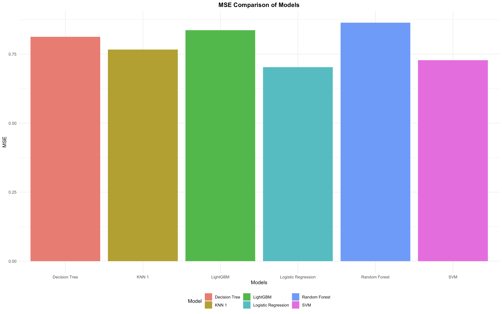

<h1>Stroke Prediction using Random Forest model</h1>

Stroke is the second-leading cause of mortality and the primary global source of disability. According to the Global Stroke Factsheet published in 2022, the lifetime chance of having a stroke has increased by 50% in the last 17 years, with 1 in 4 individuals now thought to experience one. Over the course of their lifespan, 1 in 4 people over the age of 25 will experience a stroke. This year, 12.2 million individuals will experience their first stroke, and 6.5 million of them will pass away. The number of stroke victims worldwide exceeds 110 million. 
    Stroke frequency has increased by 70% since 1990, stroke fatalities have increased by 43%, stroke prevalence has increased by 102%, and disability-adjusted life years have increased by 143%. The most remarkable aspect is that 86% of stroke-related fatalities and 89% of disability-adjusted life years worldwide occur in low- and middle-income nations. Families with limited means are facing an unprecedented challenge as a result of the disproportionate impact faced by lower- and lower-middle-income nations.
    The World Stroke Organization also states that metabolic factors, including high systolic blood pressure, a high body mass index, a high fasting plasma glucose level, a high total cholesterol level, and a low glomerular filtration rate, are responsible for 71.0% (64.6-77.1) of the incidence of stroke. Smoking, eating poorly, and not getting enough exercise account for occurrences of the stroke load, while environmental hazards like lead exposure and air pollution account for 37.8%. Through examining some attributes that could lead to stroke, we try to predict and build a model that helps individuals identify the probability of themselves getting artery diseases in a simple and affordable way.  
    

    
     
    
<h2>Aim and Objective</h2>•	To predict the likelihood of stroke risk cases happening by using simple data.
        •	To develop an interface that can be used by anyone to make stroke predictions.
        •	Identify the simplest indicators that lead to stroke.
        •	Determined the appropriate data mining techniques for the prepared dataset.
        •	Implement suitable data mining techniques for the dataset.
        <h2>Model Comparison</h2>
        

            
            
            
            
            
            
        

        <h2>Conclusion</h2>
        
In a nutshell, after processing with the data pre-processing 
            and up until processing with modeling the outcome has been 
            determined. When passing the analysis, the most suitable and 
            accurate model in our analysis will be RANDOM FOREST after 
            comparing with a total of 6 models which include LightGBM, 
            KNN, decision tree, SVM, random forest, and logistic regression. 
            We have identified that age, marital status, heart disease, BMI, 
            and average glucose level are the most important indicators that 
            determine whether one has a stroke. By implementing the shiny 
            framework, our work enables people to simply enter the data that
             are commonly known to predict their stroke likelihood.

    

